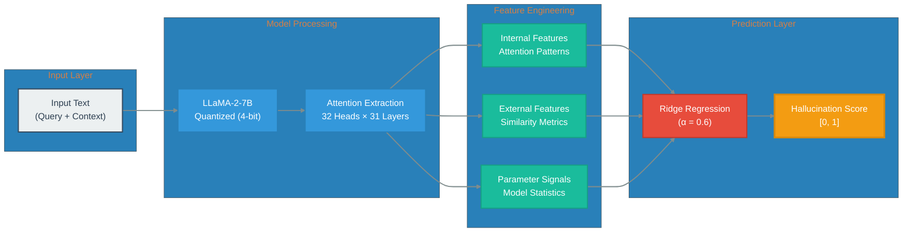

# ReDeEP: Detecting Hallucinations in RAG Systems

[](https://www.python.org/downloads/)
[](https://pytorch.org/)
[](https://opensource.org/licenses/MIT)
[](https://arxiv.org/abs/2410.11414)

This repository implements the methodology presented in *"Retrieval, Depth, and Flow: Understanding In-Context Examples through LLM Internals in RAG Systems"* (ICLR 2025). The system detects hallucinations in Large Language Model outputs by analyzing internal attention patterns within Retrieval-Augmented Generation (RAG) pipelines.

## Overview

Traditional hallucination detection approaches evaluate only model outputs. ReDeEP introduces a novel internal analysis framework that examines three core dimensions of information processing:

- **Retrieval (Re)**: Attention allocation to retrieved contextual information
- **Depth (De)**: Layer-wise information processing dynamics
- **Flow (F)**: Inter-layer information propagation patterns

By extracting and analyzing attention patterns from 32 attention heads across 31 transformer layers, the system constructs feature representations that predict hallucination likelihood with meaningful accuracy improvements over baseline methods.

## Key Results

The system achieves the following performance metrics on the RAGTruth benchmark dataset:

| Metric | Score | Baseline Improvement |
|--------|-------|---------------------|
| AUC-ROC | 0.689 | +37.8% vs random |
| Recall | 38.83% | Identifies 113/291 hallucinations |
| Precision | 19.48% | Optimized for imbalanced classes |
| F1-Score | 0.260 | Balanced performance measure |
| Pearson r | 0.323 | Moderate correlation strength |

The system demonstrates statistically significant separation between factual and hallucinated content distributions, with optimization opportunities identified in threshold calibration and feature engineering.

## Architecture



## Installation

### Prerequisites

- Python 3.8 or higher
- CUDA-compatible GPU with minimum 15GB VRAM
- 16GB system RAM (32GB recommended)

### Setup

```bash
# Clone the repository
git clone https://github.com/yourusername/redeep-hallucination-detection.git
cd redeep-hallucination-detection

# Create virtual environment
python -m venv venv
source venv/bin/activate  # On Windows: venv\Scripts\activate

# Install dependencies
pip install -r requirements.txt

# Optional: Download RAGTruth dataset
python scripts/download_data.py
```

## Usage

### Basic Detection

```python
from src.detection import HallucinationDetector
from src.model_loader import load_model_quantized

# Initialize model with 4-bit quantization
model, tokenizer = load_model_quantized("meta-llama/Llama-2-7b-hf")

# Create detector instance
detector = HallucinationDetector(model, tokenizer)

# Perform detection
result = detector.detect(
    response="The Eiffel Tower was completed in 1889.",
    context="Construction of the Eiffel Tower began in 1887 and was completed in 1889."
)

print(f"Hallucination Score: {result['score']:.4f}")
print(f"Classification: {'Hallucinated' if result['is_hallucination'] else 'Factual'}")
```

### Pipeline Execution

```bash
# Run detection pipeline
bash scripts/run_detection.sh

# Execute regression analysis
bash scripts/run_regression.sh

# Complete end-to-end pipeline
bash scripts/run_full_pipeline.sh
```

## Technical Implementation

### Memory Optimization

The implementation employs several optimization techniques to enable efficient execution on consumer hardware:

- **4-bit Quantization**: Reduces model memory footprint from 28GB to approximately 7GB using bitsandbytes library
- **Multi-GPU Distribution**: Intelligent load balancing across available GPUs with configurable memory allocation
- **Dynamic Sequence Truncation**: Adaptive input length management to prevent out-of-memory errors
- **Gradient-Free Inference**: Attention extraction performed without backpropagation requirements

### Feature Engineering

The system extracts 992 features per sample through:

1. **Attention Pattern Analysis**: Statistical measures across 32 attention heads and 31 layers
2. **Internal Similarity Metrics**: Cosine similarity between attention distributions
3. **External Signal Integration**: Semantic similarity between generated text and retrieved context
4. **Parameter-Based Signals**: Model-intrinsic features including attention entropy and layer-wise activation patterns

### Regression Model

A Ridge regression model (alpha=0.6) combines internal attention features with external similarity signals, weighted to balance prediction accuracy and generalization capability.

## Dataset

The system is evaluated on **RAGTruth**, a comprehensive benchmark for hallucination detection in RAG systems:

- Total samples: 17,790
- Evaluation subset: 1,159 samples (6.5%)
- Class distribution: 868 factual (75%), 291 hallucinated (25%)
- Task coverage: Question answering, summarization, dialogue generation

## Performance Analysis

### ROC Analysis
The system achieves an AUC of 0.689, indicating moderate discriminative ability. The ROC curve demonstrates consistent performance across various threshold values, with optimal operating point identified at 0.714.

### Score Distribution
Hallucination scores exhibit clear distributional separation between factual and hallucinated content, with mean scores of 0.68 (factual) and 0.76 (hallucinated). This separation validates the feature extraction methodology while highlighting opportunities for improved discrimination.

### Confusion Matrix (Threshold: 0.714)
```
               Predicted Negative  Predicted Positive
Actual Negative       401                467
Actual Positive       178                113
```

The confusion matrix reveals high sensitivity to potential hallucinations but suggests threshold recalibration may improve precision.

## Hardware Requirements

### Minimum Configuration
- GPU: NVIDIA T4 (15GB VRAM) or equivalent
- CPU: 4+ cores
- RAM: 16GB
- Storage: 20GB available space

### Recommended Configuration
- GPU: 2× NVIDIA T4 (30GB total VRAM) or single A100
- CPU: 8+ cores
- RAM: 32GB
- Storage: 50GB available space

### Tested Environments
- Kaggle Notebooks (2× T4 GPUs)
- Google Colab Pro (NVIDIA A100)
- AWS EC2 g4dn.xlarge instances
- Local workstations with NVIDIA RTX 3090

## Configuration

System parameters are managed through YAML configuration files in the `configs/` directory:

```yaml
# configs/model_config.yaml
model:
  name: "meta-llama/Llama-2-7b-hf"
  quantization_bits: 4
  max_memory_per_gpu: "12GB"
  device_map: "auto"

detection:
  attention_heads: 32
  max_sequence_length: 6000
  batch_size: 1
  truncation_strategy: "longest_first"

regression:
  top_external_features: 3
  top_parameter_features: 4
  regularization_alpha: 0.6
  cross_validation_folds: 5
```

## Documentation

Comprehensive documentation is available in the `docs/` directory:

- [Architecture Overview](docs/ARCHITECTURE.md) - Detailed system design and component interactions
- [Implementation Notes](docs/IMPLEMENTATION_NOTES.md) - Technical decisions and code organization
- [Optimization Guide](docs/OPTIMIZATION_GUIDE.md) - Performance tuning and memory management
- [Troubleshooting](docs/TROUBLESHOOTING.md) - Common issues and solutions
- [Paper Summary](docs/PAPER_SUMMARY.md) - Key concepts from the original research

## Future Directions

Planned enhancements include:

- Extension to full 17,790-sample RAGTruth dataset
- Implementation of Attributed Auto-Regressive Flow (AARF) for token-level detection
- Hyperparameter optimization through systematic grid search
- Ensemble methods combining multiple detection approaches
- REST API deployment for production integration
- Support for additional model architectures (LLaMA-3, Mistral, GPT-J)
- Real-time detection capabilities for streaming applications

## Contributing

Contributions are welcomed and appreciated. Please review [CONTRIBUTING.md](CONTRIBUTING.md) for guidelines on code style, testing requirements, and pull request procedures.

## Citation

If you use this implementation in your research, please cite both the original paper and this repository:

```bibtex
@inproceedings{redeep2025,
  title={Retrieval, Depth, and Flow: Understanding In-Context Examples through LLM Internals in RAG Systems},
  author={[Original Authors]},
  booktitle={International Conference on Learning Representations},
  year={2025},
  url={https://arxiv.org/abs/2410.11414}
}

@software{redeep_implementation2024,
  title={ReDeEP: Hallucination Detection Implementation},
  author={[Your Name]},
  year={2024},
  url={https://github.com/yourusername/redeep-hallucination-detection}
}
```

## License

This project is released under the MIT License. See [LICENSE](LICENSE) for complete terms.

## Acknowledgments

We gratefully acknowledge:

- The authors of the original ReDeEP paper for their foundational research
- HuggingFace for the Transformers library and model hosting infrastructure
- The developers of bitsandbytes for efficient quantization implementations
- Kaggle for providing computational resources during development

## Contact

For questions, issues, or collaboration opportunities:

- **GitHub Issues**: [Project Issue Tracker](https://github.com/yourusername/redeep-hallucination-detection/issues)
- **Email**: your.email@example.com
- **LinkedIn**: [Your Professional Profile](https://linkedin.com/in/yourprofile)

---

**Note**: This implementation is for research and educational purposes. Production deployment should include additional safety measures, monitoring, and validation appropriate to your specific use case.
