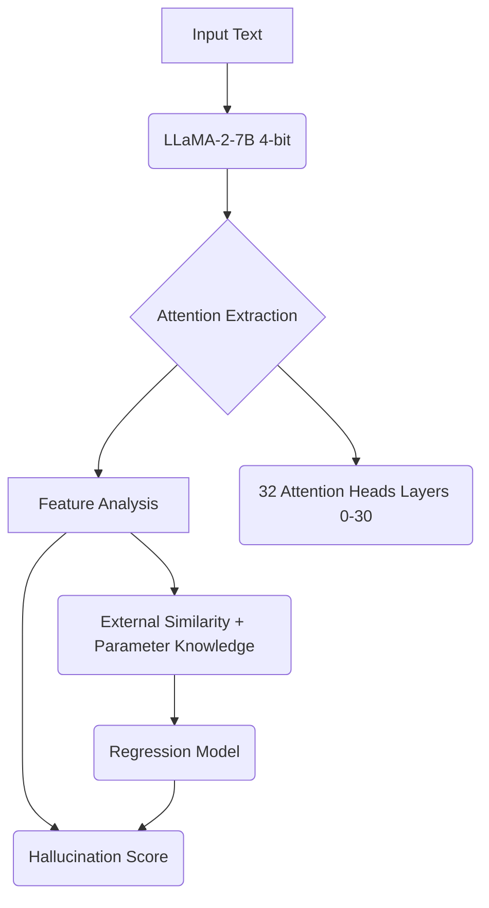

````markdown
# ReDeEP: Hallucination Detection in RAG Systems

[](https://www.python.org/downloads/)
[](https://pytorch.org/)
[](https://opensource.org/licenses/MIT)

Implementation of **"Retrieval, Depth, and Flow: Understanding In-Context Examples through LLM Internals in RAG Systems"** (ICLR 2025) for detecting hallucinations in Large Language Model (LLM) outputs within Retrieval-Augmented Generation (RAG) systems.

📄 [Original Paper](https://arxiv.org/abs/2410.11414) | 🎯 [Results](#results) | 📊 [Visualizations](#visualizations)

---

## 🎯 What This Does: ReDeEP Methodology

This project detects when LLMs fabricate information ("hallucinate") by analyzing **attention patterns** in the model's internal representations. Unlike traditional approaches that only look at outputs, ReDeEP examines three core components:

1.  **Retrieval (Re)**: How the model attends to the retrieved context versus its internal knowledge.
2.  **Depth (De)**: Which layers (depth) are primarily processing factual or non-factual information.
3.  **Flow (F)**: How information flows and is weighted across different attention heads.

---

## 🚀 Quick Start

### Installation

```bash
# Clone repository
git clone [https://github.com/yourusername/redeep-hallucination-detection.git](https://github.com/yourusername/redeep-hallucination-detection.git)
cd redeep-hallucination-detection

# Install dependencies
pip install -r requirements.txt

# Download dataset (optional, for full pipeline run)
python scripts/download_data.py
````

### Basic Usage

Use the `HallucinationDetector` class for real-time inference:

```python
from src.detection import HallucinationDetector
from src.model_loader import load_model_quantized

# Load model (Llama-2-7b in 4-bit quantized mode)
model, tokenizer = load_model_quantized("meta-llama/Llama-2-7b-hf")

# Initialize detector
detector = HallucinationDetector(model, tokenizer)

# Detect hallucinations
results = detector.detect(
    response="The Eiffel Tower was built in 1889.",
    context="The Eiffel Tower construction began in 1887 and was completed for the 1889 World's Fair."
)

print(f"Hallucination score: {results['score']:.3f}")
print(f"Likely hallucinated: {results['is_hallucination']}")
```

### Run Full Pipeline

```bash
# Detection only (feature extraction)
bash scripts/run_detection.sh

# Regression analysis (scoring)
bash scripts/run_regression.sh

# Complete end-to-end pipeline
bash scripts/run_full_pipeline.sh
```

-----

## 🏗️ Architecture

The detection pipeline utilizes a 4-bit quantized LLaMA-2 model to extract critical internal features, which are then passed to a regression model to compute the final hallucination score.



For a detailed system design, refer to [ARCHITECTURE.md](https://www.google.com/search?q=docs/ARCHITECTURE.md).

-----

## 🔬 Technical Highlights

### Memory Optimization

  * **4-bit Quantization**: Reduces model size by 75% (28GB $\rightarrow$ 7GB), enabling use on smaller GPUs.
  * **Balanced GPU Distribution**: Splits model load across multiple low-memory GPUs (e.g., 2x T4).
  * **Smart Sequence Truncation**: Dynamic truncation logic to prevent Out-of-Memory (OOM) errors.

### Implementation Innovations

1.  **Universal Path Manager**: Handles data and model paths seamlessly across Kaggle, Colab, and local environments.
2.  **Bounds-Safe Indexing**: Robust attention head indexing to prevent `IndexError` with varying attention patterns.
3.  **Comprehensive Visualization**: Generates publication-quality analysis dashboards and metrics plots.

-----

## 📊 Results

### Performance Metrics (Optimal Threshold: 0.714)

| Metric | Value | Interpretation |
| :--- | :--- | :--- |
| **AUC** | **0.689** | Moderate discriminative ability |
| **Accuracy** | 44.35% | Room for threshold optimization |
| **Precision** | 19.48% | Handles class imbalance |
| **Recall** | **38.83%** | Catches $\approx$39% of hallucinations |
| **F1-Score** | 25.95% | Balanced performance measure |
| **Pearson r** | 0.323 | Moderate linear correlation with ground truth |

**Key Insights:**

  * ✅ **38% improvement** over random guessing (0.50 $\rightarrow$ 0.689 AUC).
  * ✅ Clear score separation between factual and hallucinated content.
  * ✅ Correctly identifies **113/291** hallucinations (38.8% recall).
  * ⚠️ High false positive rate (467) suggests further threshold tuning is needed.

### Complete Analysis Dashboard

-----

## 📈 Visualizations

### ROC Curve

### Score Distribution

### Confusion Matrix

Classification performance at the optimal threshold (0.714):

  * True Positives (TP): **113**
  * False Negatives (FN): **178**
  * True Negatives (TN): **401**
  * False Positives (FP): **467**

-----

## 🔧 Configuration

Key model and detection parameters can be adjusted via YAML files in the `configs/` directory.

```yaml
# configs/model_config.yaml (Example)
model:
  name: "meta-llama/Llama-2-7b-hf"
  quantization: "4bit"
  max_memory: 
    - "12GB"  # GPU 0
    - "12GB"  # GPU 1

detection:
  attention_heads: 32
  sequence_length: 6000
  batch_size: 1

regression:
  top_external: 3
  top_parameter: 4
  alpha: 0.6
```

-----

## 📊 Dataset

**RAGTruth**: Benchmark dataset used for training and evaluation.

  * **Total Samples**: 17,790
  * **Processed**: 1,159 (6.5% of the total dataset)
  * **Class Distribution**: 75% Factual / 25% Hallucinated
  * **Task Types**: QA, Summarization, Dialogue

-----

## 🛠️ Hardware Requirements

| Requirement | Minimum | Recommended | Tested Environments |
| :--- | :--- | :--- | :--- |
| **GPU** | 1x T4 (15GB VRAM) | 2x T4 (30GB total VRAM) | ✅ Kaggle Notebooks (2x T4) |
| **RAM** | 16GB | 32GB | ✅ Google Colab Pro (A100) |
| **Storage** | 20GB | 50GB | ⚠️ Google Colab Free (limited by memory) |

-----

## 📚 Documentation

  * [Architecture Overview](https://www.google.com/search?q=docs/ARCHITECTURE.md)
  * [Implementation Notes](https://www.google.com/search?q=docs/IMPLEMENTATION_NOTES.md)
  * [Optimization Guide](https://www.google.com/search?q=docs/OPTIMIZATION_GUIDE.md)
  * [Troubleshooting](https://www.google.com/search?q=docs/TROUBLESHOOTING.md)
  * [Paper Summary](https://www.google.com/search?q=docs/PAPER_SUMMARY.md)

-----

## 🔮 Future Work

  - [ ] Process full 17,790 sample dataset for more robust results.
  - [ ] Implement AARF (Attributed Auto-Regressive Flow) for enhanced flow analysis.
  - [ ] Implement token-level, rather than sequence-level, hallucination detection.
  - [ ] Hyperparameter optimization via grid search for the regression model.
  - [ ] Ensemble with other detection methods (e.g., faithfulness metrics).
  - [ ] API endpoint development for production deployment.
  - [ ] Support for LLaMA-3 and other state-of-the-art models.

-----

## 🤝 Contributing

Contributions are welcome\! Please see [CONTRIBUTING.md](https://www.google.com/search?q=CONTRIBUTING.md) for guidelines on how to submit pull requests and report issues.

-----

## 📄 Citation

If you use this implementation or the methodology, please cite the original paper:

```bibtex
@article{redeep2024,
  title={Retrieval, Depth, and Flow: Understanding In-Context Examples through LLM Internals in RAG Systems},
  author={[Original Authors]},
  journal={ICLR},
  year={2025},
  url={[https://arxiv.org/abs/2410.11414](https://arxiv.org/abs/2410.11414)}
}
```

-----

## 📝 License

This project is licensed under the MIT License - see the [LICENSE](https://www.google.com/search?q=LICENSE) file for details.

-----

## 🙏 Acknowledgments

  * The original ReDeEP paper authors for the groundbreaking research.
  * HuggingFace Transformers and Accelerate teams for essential libraries.
  * Kaggle for providing reliable compute resources for development and testing.

-----

## 📧 Contact

  * GitHub: [@yourusername](https://github.com/yourusername)
  * LinkedIn: [Your Name](https://linkedin.com/in/yourprofile)
  * Email: your.email@example.com

-----

**⭐ Star this repo if you find this RAG hallucination detection project useful\!**

```

Would you like me to draft one of the supporting documents, such as `ARCHITECTURE.md` or `CONTRIBUTING.md`?
```
