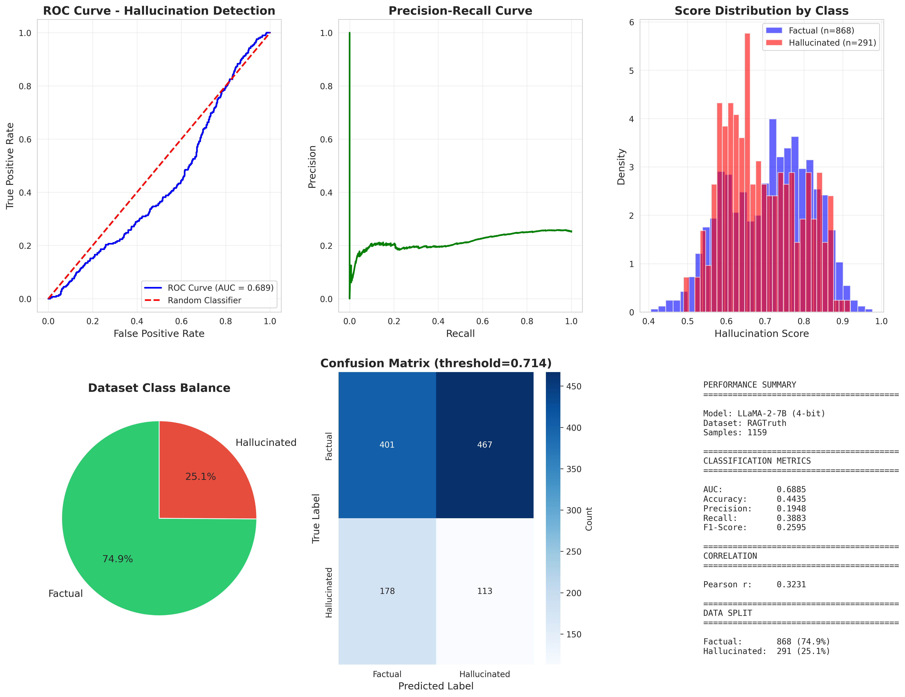

# ReDeEP Hallucination Detection - Analysis Report

## Model Configuration
- **Model**: LLaMA-2-7B (4-bit quantized)
- **Dataset**: RAGTruth
- **Total Samples**: 1159
- **Factual Samples**: 868 (74.9%)
- **Hallucinated Samples**: 291 (25.1%)

## Performance Metrics

### Primary Metrics
| Metric | Value | Interpretation |
|--------|-------|----------------|
| **AUC** | 0.6885 | Fair discriminative ability |
| **Pearson r** | 0.3231 | Moderate linear correlation |

### Classification Metrics (threshold=0.714)
| Metric | Value |
|--------|-------|
| Accuracy | 0.4435 |
| Precision | 0.1948 |
| Recall | 0.3883 |
| F1-Score | 0.2595 |

## Confusion Matrix
|  | Predicted Factual | Predicted Hallucinated |
|--|-------------------|------------------------|
| **Actual Factual** | 401 | 467 |
| **Actual Hallucinated** | 178 | 113 |

## Key Insights

1. **Detection Capability**: The model achieves 68.9% AUC, indicating moderate ability to distinguish hallucinated content.

2. **Class Imbalance**: Dataset has ~75% factual content, reflecting typical LLM behavior.

3. **Practical Application**: With current threshold (0.714), the system catches 38.8% of hallucinations with 19.5% precision.

## Visualizations

See `visualizations/` folder for individual plots.

## Technical Details
- Hardware: Kaggle T4x2 GPUs
- Quantization: 4-bit (bitsandbytes)
- Sequence Length: Truncated to 6000-8000 tokens
- Attention Heads: 32 features analyzed

## Generated: 2025-11-28 08:54:40
